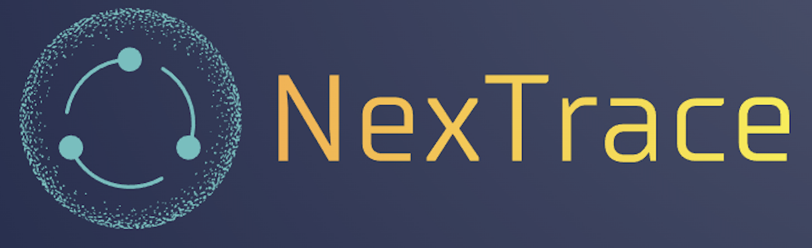

[](https://github.com/open-source-labs/NexTrace/issues)

# Nextrace

<a id="readme-top"></a>


<!-- PROJECT SHIELDS -->
<!--
*** I'm using markdown "reference style" links for readability.
*** Reference links are enclosed in brackets [ ] instead of parentheses ( ).
*** See the bottom of this document for the declaration of the reference variables
*** for contributors-url, forks-url, etc. This is an optional, concise syntax you may use.
*** https://www.markdownguide.org/basic-syntax/#reference-style-links
-->
[![Contributors][contributors-shield]][contributors-url]
[![Forks][forks-shield]][forks-url]
[![Stargazers][stars-shield]][stars-url]
[![Issues][issues-shield]][issues-url]
[![MIT License][license-shield]][license-url]
[![LinkedIn][linkedin-shield]][linkedin-url]


<p align="center"></p>
<br />

<!-- TABLE OF CONTENTS -->
<details>
  <summary>Table of Contents</summary>
  <ol>
    <li>
      <a href="#about-the-project">About The Project</a>
      <ul>
        <li><a href="#built-with">Built With</a></li>
      </ul>
    </li>
    <li>
      <a href="#getting-started">Getting Started</a>
      <ul>
        <li><a href="#prerequisites">Prerequisites</a></li>
        <li><a href="#installation">Installation</a></li>
      </ul>
    </li>
    <li><a href="#usage">Usage</a></li>
    <li><a href="#roadmap">Roadmap</a></li>
    <li><a href="#contributing">Contributing</a></li>
    <li><a href="#license">License</a></li>
    <li><a href="#contact">Contact</a></li>
    <li><a href="#acknowledgments">Acknowledgments</a></li>
  </ol>
</details>


<!-- ABOUT THE PROJECT -->
## About The Project

Nextrace is a HTTP Request Performance Monitoring tool that helps you to identify and troubleshoot performance bottlenecks in your Next.js app. All HTTP requests (server and client) from running your Next.js app are displayed in one place with their associated observability metrics along with intuitive visualizations of the data. All console.log statements are collected and displayed together with buttons that automatically navigate you to its respective file.

<p align="right">(<a href="#readme-top">back to top</a>)</p>

<!-- GETTING STARTED -->
## Getting Started


### Prerequisites

First, install dependencies in your Next.js app:
  ```sh
  npm install nextrace
  ```

### Installation
Search for Nextrace in VSCode Extension Marketplace and click Install.

<p align="right">(<a href="#readme-top">back to top</a>)</p>

<!-- USAGE EXAMPLES -->
## Usage

1.) Click on NexTrace Logo <br>
2.) Click Choose File Button to select entry point to your Next.js application <br>
3.) Click Choose Root Button to select your app folder (note: this folder should not be your project folder as it contains node_modules containing a large number of files. Instead select your app folder containing the entry point of your application) <br>
4.) Click Start to start tracking your application's network requests <br>
5.) Click Logs to display additional panel for your console logs for easy file Navigation <br>
6.) When finished, click STOP. <br>
7.) Optional: Incase of any issues removing boiler plate code, select your file and root as you did on steps 2 & 3 and click Clean Files buttton to remove boiler plate code. <br>

<p align="right">(<a href="#readme-top">back to top</a>)</p>


<!-- CONTRIBUTING -->
## Contributing

Contributions are what make the open source community such an amazing place to learn, inspire, and create. Any contributions you make are **greatly appreciated**.

If you have a suggestion that would make this better, please fork the repo and create a pull request. You can also simply open an issue with the tag "enhancement".
Don't forget to give the project a star! Thanks again!

1. Fork the Project
2. Create your Feature Branch (`git checkout -b feature/AmazingFeature`)
3. Commit your Changes (`git commit -m 'Add some AmazingFeature'`)
4. Push to the Branch (`git push origin feature/AmazingFeature`)
5. Open a Pull Request

<p align="right">(<a href="#readme-top">back to top</a>)</p>


<!-- LICENSE -->
## License

Distributed under the MIT License. See `LICENSE.txt` for more information.

<p align="right">(<a href="#readme-top">back to top</a>)</p>


<!-- CONTACT -->
## Contact

Your Name - NexTrace10@gmail.com

Project Link: [https://github.com/oslabs-beta/NexTrace](https://github.com/oslabs-beta/NexTrace)

<p align="right">(<a href="#readme-top">back to top</a>)</p>


<!-- ACKNOWLEDGMENTS -->
## Acknowledgments

Use this space to list resources you find helpful and would like to give credit to. I've included a few of my favorites to kick things off!

* [Choose an Open Source License](https://choosealicense.com)
* [GitHub Emoji Cheat Sheet](https://www.webpagefx.com/tools/emoji-cheat-sheet)
* [Malven's Flexbox Cheatsheet](https://flexbox.malven.co/)
* [Malven's Grid Cheatsheet](https://grid.malven.co/)
* [Img Shields](https://shields.io)
* [GitHub Pages](https://pages.github.com)
* [Font Awesome](https://fontawesome.com)
* [React Icons](https://react-icons.github.io/react-icons/search)

<p align="right">(<a href="#readme-top">back to top</a>)</p>


<!-- MARKDOWN LINKS & IMAGES -->
<!-- https://www.markdownguide.org/basic-syntax/#reference-style-links -->
[contributors-shield]: https://img.shields.io/github/contributors/oslabs-beta/NexTrace.svg?style=for-the-badge
[contributors-url]: https://github.com/oslabs-beta/NexTrace/graphs/contributors
[forks-shield]: https://img.shields.io/github/forks/oslabs-beta/NexTrace.svg?style=for-the-badge
[forks-url]: https://github.com/oslabs-beta/NexTrace/network/members
[stars-shield]: https://img.shields.io/github/stars/oslabs-beta/NexTrace.svg?style=for-the-badge
[stars-url]: https://github.com/oslabs-beta/NexTrace/stargazers
[issues-shield]: https://img.shields.io/github/issues/oslabs-beta/NexTrace.svg?style=for-the-badge
[issues-url]: https://github.com/oslabs-beta/NexTrace/issues
[license-shield]: https://img.shields.io/github/license/oslabs-beta/NexTrace.svg?style=for-the-badge
[license-url]: https://github.com/oslabs-beta/NexTrace/blob/main/LICENSE
[linkedin-shield]: https://img.shields.io/badge/-LinkedIn-black.svg?style=for-the-badge&logo=linkedin&colorB=555
[linkedin-url]: https://www.linkedin.com/company/nextrace-dev
[product-screenshot]: images/screenshot.png
[Next.js]: https://img.shields.io/badge/next.js-000000?style=for-the-badge&logo=nextdotjs&logoColor=white
[Next-url]: https://nextjs.org/
[React.js]: https://img.shields.io/badge/React-20232A?style=for-the-badge&logo=react&logoColor=61DAFB
[React-url]: https://reactjs.org/

[opentelemetry.io]: https://img.shields.io/badge/opentelemetry-blue
[opentelemetry-url]: https://opentelemetry.io/
[Express.js]: https://img.shields.io/badge/Express.js-404D59?style=for-the-badge
[Express-url]: https://expressjs.com/
[VSCode]: https://img.shields.io/badge/Made%20for-VSCode-1f425f.svg
[VSCode-url]: https://code.visualstudio.com/
[Jest]: https://img.shields.io/badge/Jest-323330?style=for-the-badge&logo=Jest&logoColor=white
[Jest-url]: https://jestjs.io/
[Testing-library]: https://img.shields.io/badge/testing%20library-323330?style=for-the-badge&logo=testing-library&logoColor=red
[Testing-library-url]: https://testing-library.com/


## NexTrace Contributors

Accelerated by [OS Labs](https://github.com/open-source-labs) and devloped by [Charles Dunlap](https://github.com/CharlesAndrewDunlap), [Connor Keyes](https://github.com/connorkeyes), [Simon Lin](https://github.com/kedjek), & [Jose Velasco](https://github.com/JoseAVelasco).